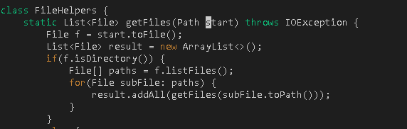
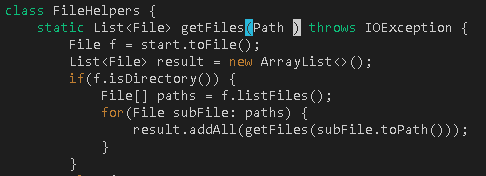
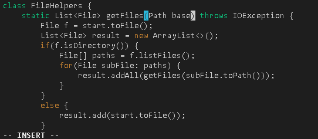
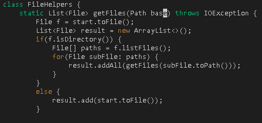
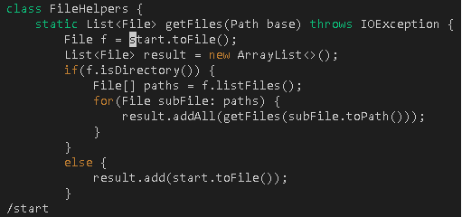
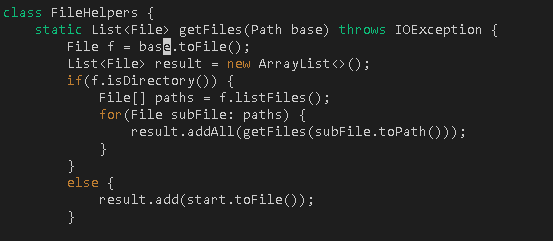
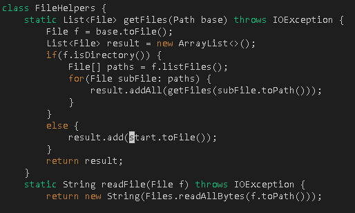
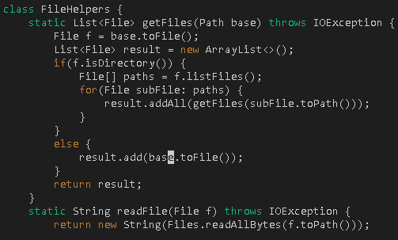
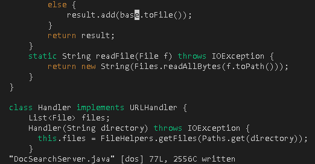

**Lab Report 4**

**Part 1**

I'm going to do: In ```DocSearchServer.java```, change the name of the ```start``` parameter of ```getFiles```, and all of its uses, to instead be called ```base```.



In vim ```/start <enter>```, This vim command finds the first occurance of start.



```'C' 'E'```. This vim command deletes "start" and enter insert mode.



```base```, I replaced the first start with base



```<esc>```, this command exits insert mode and goes back to normal mode.



```N```, this command finds the next occurance of start 



```.```, this command replaces start with base. '.' repeats the last command, which in this case will be delete start and type base.



```N```, this command finds the last occurance of start



```.```, this command replaces start with base.



```:w```, this command saves the changes done in vim.

These are all the steps I took to replace all "start" in ```getFiles``` to "base". I used a total of 20 keys presesed.

**Part 2**

It took me around 2 minutes to edit the file, scp the file and run the file in the remote server.

It took me around 1 minute to edit the file, and run the file in the remote server.

Which of these two styles would you prefer using if you had to work on a program that you were running remotely, and why?

*I would prefer editing the task in vim because its much faster than editing the task in visual studio code,and scp it. I think if I'm already comfortable with vim, I can complete this task much faster.*

What about the project or task might factor into your decision one way or another?

*If my task is to edit alot of the code or replace many lines of the code, I believe editing it in visual studio code will be much more efficient. But if you only need to make minor changes to the code, editing in vim would be much more efficient.*
